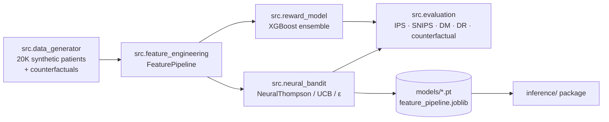
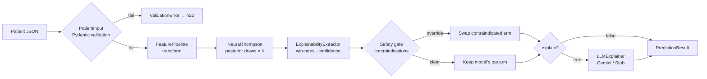

# Diabetes Contextual Bandits

**Personalized Type 2 Diabetes Treatment Selection with Contextual Armed Bandits**

> Given a patient's clinical context (age, BMI, HbA1c, eGFR, comorbidities, …), learn which of five glucose-lowering treatments produces the best outcome — balancing exploration of uncertain options against exploitation of known-good ones.

**Author:** Kudzai P. Matizirofa (R191582L) · **Date:** 2024–2026

---

## Problem

Selecting the right glucose-lowering medication for a Type 2 Diabetes patient depends on dozens of interacting clinical factors. Standard guidelines provide general rules, but the optimal choice for a specific patient is often unclear. This project frames treatment selection as a **contextual bandit** problem:

- **Context** — 16 clinical features + 9 engineered interactions
- **Actions** — Metformin, GLP-1 RA, SGLT-2i, DPP-4i, Insulin
- **Reward** — HbA1c reduction (higher is better, capped at `REWARD_CAP_PP`)
- **Goal** — a policy that maximises expected reward per patient

Two deliverables share the codebase:

1. **`src/`** — research code (data generator, models, OPE, notebooks).
2. **`inference/`** — a production-oriented façade that wraps the trained model behind a schema-validated API with safety gates, explanations, and continuous learning. See [`inference/USAGE.md`](inference/USAGE.md).

---

## Approach

### Models

| Family | Model | Key idea |
|---|---|---|
| **Tree** | XGBoost Ensemble | 5 per-treatment regressors + greedy / softmax policy |
| **Linear online** | LinUCB | Linear reward + UCB, fully online, no pre-training |
| **Neural** | NeuralGreedy | Multi-head deep network, pure exploitation baseline |
| **Neural** | NeuralEpsilon | Same network + ε-greedy with decay |
| **Neural** | NeuralUCB | Last-layer covariance + UCB score |
| **Neural** | **NeuralThompson** | Bayesian linear posterior on learned features, Thompson sampling — the deployed model |

### Evaluation

| Method | Type | What it tells you |
|---|---|---|
| Counterfactual | Offline | Ground-truth policy value using all 5 potential outcomes (synthetic only) |
| IPS / SNIPS | Offline (OPE) | Re-weights logged data to estimate a new policy |
| DM | Offline (OPE) | Direct method — predicts counterfactual outcomes |
| DR | Offline (OPE) | Doubly robust — combines IPS and DM |
| Online simulation | Online | Agent interacts with the reward oracle, tracks cumulative regret |

---

## Architecture

### Training & research pipeline



### Inference request flow



### Continuous-learning update flow

```mermaid
flowchart LR
    A[LearningRecord<br/>patient + action + reward] --> B{Validate}
    B -->|fail| B1[LearningAck<br/>accepted=false]
    B -->|ok| C[Sherman-Morrison<br/>posterior update]
    C --> D[Replay buffer]
    D --> E{step %<br/>retrain_every?}
    E -->|match| F[Backbone<br/>mini-batch fine-tune]
    E -->|skip| G
    F --> G[DriftMonitor.observe]
    G --> H{abs(z) ><br/>threshold?}
    H -->|yes| I[Drift alert]
    H -->|no| J[LearningAck<br/>accepted=true]
    I --> J
```

---

## Project structure

```
diabetes-bandits/
├── README.md
├── environment.yml              Conda environment
│
├── src/                         Research / training code
│   ├── __init__.py
│   ├── data_generator.py        Synthetic patients + reward oracle
│   ├── feature_engineering.py   FeaturePipeline (16 + 9 features)
│   ├── reward_model.py          XGBoost ensemble + single
│   ├── neural_bandit.py         NeuralThompson / UCB / ε / Greedy
│   ├── policies.py              7 policy strategies + factory
│   ├── online_simulator.py      Online contextual bandit loop
│   ├── evaluation.py            OPE: IPS · SNIPS · DM · DR
│   ├── explainability.py        Feature attribution + safety gate
│   ├── interpretability.py      Integrated-gradients wrapper
│   ├── llm_explain.py           Gemini / Pydantic-guarded clinical explainer
│   ├── monitoring.py            DriftMonitor (rolling z-score)
│   ├── reward_model.py          XGBoost reward models
│   ├── cli.py                   Typer-based train / eval CLI
│   └── utils.py                 Plotting, logging, helpers
│
├── inference/                   Shippable inference façade (see inference/USAGE.md)
│   ├── __init__.py              Public surface
│   ├── config.py                Three-layer config (defaults → YAML → env)
│   ├── schemas.py               PatientInput · LearningRecord · PredictionResult · LearningAck
│   ├── errors.py                InferenceError hierarchy
│   ├── engine.py                InferenceEngine (sync + async)
│   ├── streaming.py             LearningSession / AsyncLearningSession
│   ├── stub_client.py           Deterministic offline LLM for tests
│   ├── USAGE.md                 Developer guide for this module
│   └── examples/
│       ├── cli_example.sh       Shell end-to-end demo
│       └── fastapi_app.py       FastAPI server with SSE streaming
│
├── notebooks/                   Jupyter experiments (run in order)
│   ├── 01_data_exploration.ipynb
│   ├── 02_reward_modeling.ipynb
│   ├── 04_neural_bandit.ipynb
│   ├── 05_online_simulation.ipynb
│   ├── 06_offline_evaluation.ipynb
│   ├── 07_model_comparison.ipynb
│   ├── 08_prediction_demo.ipynb
│   ├── 09_exploration_vs_exploitation.ipynb
│   ├── 10_prediction_with_explanation.ipynb
│   ├── 11_calibration_and_continuous_learning.ipynb
│   ├── 12_inference_prediction_demo.ipynb
│   └── 13_inference_continuous_learning_demo.ipynb
│
├── tests/                       pytest suite (92 tests)
└── scripts/                     Repo-maintenance tooling
    └── build_inference_notebooks.py   Regenerates notebooks 12 & 13 from nbformat source
```

**Directories created on demand** (not checked into git):

| Folder | Created by | Contents |
|---|---|---|
| `data/` | `python -m src.data_generator` (or Zenodo download) | `bandit_dataset.csv` — 20K patients + counterfactuals |
| `models/` | `python -m src.cli train` | `neural_thompson.pt`, `feature_pipeline.joblib`, reward-model JSON |
| `runs/` | `python -m src.cli train` | Per-run JSON with hyperparameters + metrics (lightweight MLflow stand-in) |
| `results/` | Notebooks 05–07 | Plots, per-round CSVs, OPE summaries |

---

## Quick start

### 1. Environment

```bash
conda env create -f environment.yml
conda activate diabetes-bandits
pip install google-genai          # optional — only for real LLM explanations
```

### 2. Get the dataset

Either regenerate it locally:

```bash
python -m src.data_generator      # writes data/bandit_dataset.csv
```

…or download the archived copy from Zenodo:

```bash
mkdir -p data
# Download bandit_dataset.csv from: https://zenodo.org/records/8339691
```

The synthetic generator is deterministic (seeded), so local regeneration is equivalent to the archived copy for the 20K-patient corpus.

### 3. Train the bandit and save the pipeline

```bash
python -m src.cli train           # trains NeuralThompson, writes models/neural_thompson.pt
                                  # and logs the run to runs/<tag>.json
```

The CLI also fits and saves `models/feature_pipeline.joblib` so the inference engine can load both artefacts from disk.

### 4. Explore the research notebooks

```bash
jupyter lab
```

Notebooks run in order `01 → 02 → 04 → … → 11`. Numbering skips `03` for historical reasons — no content gap.

### 5. Inference API — single prediction

```python
from inference import InferenceEngine, InferenceConfig

engine = InferenceEngine.from_config(InferenceConfig.load())
result = engine.predict({
    "age": 62, "bmi": 34.2, "hba1c_baseline": 8.9, "egfr": 85.0,
    "diabetes_duration": 6.0, "fasting_glucose": 180.0, "c_peptide": 1.4,
    "bp_systolic": 140.0, "ldl": 120.0, "hdl": 45.0,
    "triglycerides": 200.0, "alt": 30.0,
    "cvd": 1, "ckd": 0, "nafld": 1, "hypertension": 1,
    "patient_id": "PID-0001",
})
print(result.recommended, result.confidence_pct, result.safety_status)
```

Batch, continuous learning, FastAPI, and the full config reference are covered in **[`inference/USAGE.md`](inference/USAGE.md)**. Runnable demos:

- `inference/examples/cli_example.sh` — shell end-to-end walkthrough
- `inference/examples/fastapi_app.py` — FastAPI server with SSE streaming
- `notebooks/12_inference_prediction_demo.ipynb` — prediction tour
- `notebooks/13_inference_continuous_learning_demo.ipynb` — update streams + drift monitoring

### 6. Tests

```bash
python -m pytest tests/ -q        # 92 tests, all green
```

---

## Dataset

The **synthetic T2D cohort** contains 20,000 patients with:

| Category | Features |
|---|---|
| Demographics | age, gender, ethnicity |
| Metabolic | BMI, HbA1c baseline, fasting glucose, C-peptide |
| Renal | eGFR |
| Cardiovascular | BP systolic, LDL, HDL, triglycerides, ALT |
| Comorbidities | CVD, CKD, NAFLD, hypertension |
| Engineered | 9 interaction features (`bmi_x_nafld`, `severity_score`, `tg_hdl_ratio`, …) |

Each row carries an observed treatment (from a guideline-biased logging policy), its propensity score, **counterfactual rewards for all five treatments**, and the oracle-optimal treatment + regret. The reward function encodes realistic clinical relationships: Metformin favours early-stage lean patients with good kidney function; GLP-1 excels for obese patients with NAFLD; SGLT-2 is optimal under CVD; DPP-4 suits elderly patients with CKD; insulin is reserved for advanced disease with β-cell failure.

An archived copy of `bandit_dataset.csv` is published at **[zenodo.org/records/8339691](https://zenodo.org/records/8339691)** for reproducibility — use it as a fixed reference corpus if you don't want to regenerate locally.

---

## Source modules

### `src/data_generator.py`
- `reward_oracle(context, treatment, noise=True)` — ground-truth reward.
- `generate_patient(rng)` — samples a realistic patient with correlated features.
- `generate_bandit_dataset()` — full 20K corpus with propensities + counterfactuals.

### `src/feature_engineering.py`
`FeaturePipeline` — 12 continuous + 4 binary + 9 interactions; optional `StandardScaler`; `.fit` / `.transform` / `.save` / `.load`.

### `src/neural_bandit.py`
Shared `RewardNetwork` backbone with 5 treatment heads. `NeuralThompson` maintains a Bayesian linear posterior on last-layer features (Sherman-Morrison updates) and supports `enable_online_retraining(...)` for G-4-style replay-buffer backbone fine-tuning.

### `src/reward_model.py`
`RewardModelEnsemble` — five per-treatment XGBoost regressors. `RewardModelSingle` — one-hot treatment encoding variant.

### `src/policies.py`
`RandomPolicy`, `GreedyPolicy`, `EpsilonGreedyPolicy`, `BoltzmannPolicy`, `UCBPolicy`, `ThompsonPolicy`, `LinUCBPolicy`, plus a `create_policy(name)` factory.

### `src/online_simulator.py`
Runs the full online bandit loop: sample patient → each agent picks → oracle reward → update. Windowed accuracy + regret metrics for learning-curve plots.

### `src/evaluation.py`
IPS / SNIPS / DM / DR with CIs, counterfactual evaluation, pairwise bootstrap significance tests, subgroup analysis.

### `src/explainability.py` + `src/interpretability.py`
`ExplainabilityExtractor` produces posterior win-rates, confidence %, IG attributions. `apply_safety_gate` enforces G-14 / G-16 contraindications (Metformin <30 eGFR, SGLT-2 <25, MTC/MEN-2 history for GLP-1, pancreatitis history, type-1 suspicion).

### `src/llm_explain.py`
`LLMExplainer` — Pydantic-guarded Gemini client with jargon filter, effect-size caps, and repair-retry loop. Swappable via `BANDITS_LLM_PROVIDER=stub|gemini`.

### `src/monitoring.py`
`DriftMonitor` — rolling-window z-score across engineered features; emits alerts at `|z| > threshold`.

### `src/cli.py`
`python -m src.cli {train,evaluate,compare}` — Typer CLI that loads data, fits the pipeline, trains the bandit, serialises artefacts, and writes a run summary to `runs/`.

---

## Inference module

Production façade over the six-phase stack. Key properties:

- **Single import surface** — `from inference import InferenceEngine, InferenceConfig, PatientInput, LearningRecord, PredictionResult, LearningAck`
- **Three-layer config** — defaults → YAML → `BANDITS_*` env vars → explicit kwargs.
- **Validation** — Pydantic v2 schemas with clinical ranges, dual `action`/`treatment` keys, nested or flat input shapes.
- **Safety gate** — contraindicated arms are excluded from the *final* recommendation; the engine returns an `override` payload describing what was blocked and why.
- **Async surface** — `apredict`, `aupdate`, `alearning_session` via `asyncio.to_thread`.
- **Continuous learning** — Sherman-Morrison posterior updates, periodic backbone fine-tune, drift monitoring, session-scoped metrics and checkpoints.
- **LLM explanations** — optional, soft-fails by default, `explain="require"` to propagate errors.

Full reference: **[`inference/USAGE.md`](inference/USAGE.md)**.

---

## Current limitations

This is a research prototype, not a clinical decision-support tool.

- **Synthetic reward oracle.** Clinically motivated but unvalidated. Effect sizes are reward-scale units, not real HbA1c deltas without calibration.
- **Counterfactual evaluation requires synthetic data.** Real logged deployments must fall back to IPS / SNIPS / DR with clipping diagnostics (`src.evaluation.truncated_ips`, `switch_estimator`).
- **LLM explanations require human review.** Pydantic schemas + jargon filter + effect-size caps are necessary, not sufficient. No LLM output should be shown to a patient or clinician without sign-off.
- **Safety gate is a backstop, not a substitute for clinical judgment.** The rule set is explicit but not exhaustive.
- **Stationarity assumption.** The online simulator assumes a stationary reward oracle unless drift is injected. Real populations drift continuously — `src.monitoring.DriftMonitor` is the production hook for catching it.

---

## Tools and packages

| Package | Purpose |
|---|---|
| Python 3.10 | Runtime |
| PyTorch | Neural contextual bandits |
| XGBoost | Reward modelling |
| scikit-learn | Preprocessing, metrics |
| pandas / numpy | Data manipulation |
| Pydantic v2 | Schema validation at the engine boundary |
| FastAPI (optional) | HTTP surface for the inference engine |
| google-genai (optional) | Gemini-backed clinical explanations |
| matplotlib / seaborn | Visualisation |
| loguru | Logging |
| pytest | Test runner |

---

## References

- Zhou et al., *Neural Contextual Bandits with UCB-based Exploration*, ICLR 2020
- Zhang et al., *Neural Thompson Sampling*, ICLR 2021
- Li et al., *A Contextual-Bandit Approach to Personalized News Article Recommendation*, WWW 2010 (LinUCB)
- Agarwal et al., *A Reductions Approach to Fair and Robust Contextual Bandits*, ICML 2018
- ADA Standards of Medical Care in Diabetes, 2024
- Dataset archive: <https://zenodo.org/records/8339691>

---

## License

Academic and research purposes.
